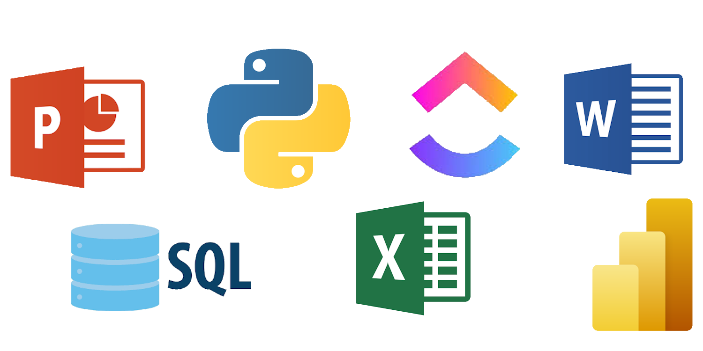

# API-3

 
 

# Proposta
 Realizar a coleta de dados e análise aprofundada sobre os sinistros de trânsito, suas causas, resultados e detalhes para um levantamento dos principais indicadores e suas variações ao longo dos ultimos dez anos.

Será feita uma análise relacionando as variações na quantidade de sinístros com artigos informativos relacionados ao trânsito

Paralelamente, será conduzido um exame detalhado das principais causas de acicentes, os veículos e as regiões com maior registro

## Primeiro Sprint

Foi desenvolvido um dashboard interativo indicando as principais causas e veículos. Mas apenas dos sinístros no estado de São Paulo inicialmente de maneira demonstrativa. Indicando as variações e as medidas tomadas ao longo dos anos para o controle de acidente.

## Segundo Sprint

 
 Serão adicionados ao deshboard mais filtros de informações dos sinistro, além de mais detalhes com mapas.
 Além de feita a relação de artigos informativos com a quantidade de sinistros. Indicando as variações e as medidas tomadas ao longo dos anos para o controle de acidentes.

## Terceiro Sprint
 
 Realizaremos um dashboard assim como o do sprint anterior, porém englobando o país inteiro com informações obtidas nos ultimos dez anos

 
 <h1>Link do Dashboard</h1>

 

 # Ferramentas Utilizadas
 - ClicUp
 - Excel
 - Power Point
 - Microsoft Word
 - SQL Workbench
 - Python
 - Power BI

 # Aplicabilidade das Ferramentas
 ##  Para facilitar o tratamento dos dados, foi feito o agrupamento de cada tipo de dado em diferentes planílhas, facilitando a interpretação e uso posterior.

 

 ### ClickUp
  Através dele foi desgnada a tarefa e o prazo das atividades de cada membro do projeto, indicando o nivel de prioridade de cada tarefa a ser realizada e em qual sprint devem ser entregues organiando em anexos os outros aplicativos utilizados

 ### Python
  Por haver uma quantidade massiva de plhanilhas com dados e de diferentes fontes, o que causava a divergencia da estrutura entre todas as planílhas, foi feita uma primeira filtragem por agrupamento de tipos de dados em outras tabelas geradas a partir do python
 ### SQL
  Após o agrupamento dos dados por tipo no SQL, foram aplicados filtros mais precisos. Essa etapa foi crucial para refinar o conjunto de dados e garantir que apenas as informações mais relevantes fossem selecionadas, otimizando a qualidade e a eficiência da análise futura no Power BI.
 ### Excel
  Para viabilizar a filtragem da planilha principal por meio de consultas SQL, foram gerados diversos arquivos auxiliares contendo planilhas segmentadas de forma criteriosa, organizadas exclusivamente com os dados relevantes e estruturadas por ano. Essa abordagem permitiu otimizar o desempenho das consultas, reduzir a complexidade dos dados processados e facilitar a manipulação e análise das informações históricas de maneira eficiente e escalável.
  
  
 # Backlog do Produto
 
<table>
  <thead>
    <tr>
      <th>Rank</th>
      <th>Prioridade</th>
      <th>User Story</th>
      <th>Estimativa</th>
      <th>Sprint</th>
    </tr>
  </thead>
  <tbody>
    <tr>
      <td>1</td>
      <td>Alta</td>
      <td>Como analistas, iremos definir escopo e métricas principais a serem apresentadas no dashboard</td>
      <td>5</td>
      <td>1º</td>
    </tr>
    <tr>
      <td>2</td>
      <td>Médio</td>
      <td>Como analistas, criaremos um backlog detalhado e que priorize as entregas. </td>
      <td>2</td>
      <td>1º</td>
    </tr>
    <tr>
      <td>3</td>
      <td>Baixo</td>
      <td>Como design, iremos desenhar esboço inicial do dashboard no Power BI. </td>
      <td>2</td>
      <td>1º</td>
    </tr>
    <tr>
      <td>4</td>
      <td>Alta</td>
      <td>Como analistas e programadores, queremos iniciar scripts básicos em Python para coleta e limpeza inicial dos dados. </td>
      <td>8</td>
      <td>1º</td>
    </tr>
    <tr>
      <td>5</td>
      <td>Alta</td>
      <td>Como analistas e programadores, queremos construir um fluxo de ETL em Python e MySQL (tratamento e padronização). </td>
      <td>8</td>
      <td>2º</td>
    </tr>
    <tr>
      <td>6</td>
      <td>Médio</td>
      <td>Como analistas, iremos definir tabelas consolidadas: mortes, frota, população e sinistros.</td>
      <td>6</td>
      <td>2º</td>
    </tr>
    <tr>
      <td>7</td>
      <td>Médio</td>
      <td>Como analistas e programadores, iremos realizar testes de consistência nos indicadores. </td>
      <td>5</td>
      <td>2º</td>
    </tr>
    <tr>
      <td>8</td>
      <td>Baixo</td>
      <td>Como analistas, iremos documentar o processo de integração e primeiros resultados.</td>
      <td> </td>
      <td>2º</td>
    </tr>
    <tr>
      <td>9</td>
      <td>Alta</td>
      <td>Como analistas, queremos implementar indicadores-chave (mortalidade, sinistros por frota, motorização, comparativos).</td>
      <td>7</td>
      <td>2º</td>
    </tr>
    <tr>
      <td>10</td>
      <td>Médio</td>
      <td>Como analistas queremos configurar filtros interativos no Power BI.</td>
      <td>4</td>
      <td>2º</td>
    </tr>
    <tr>
      <td>11</td>
      <td>Alta</td>
      <td>Como analistas, queremos consolidar análises por região e evolução dos indicadores (2015–2024).</td>
      <td>8</td>
      <td>3º</td>
    </tr>
    <tr>
      <td>12</td>
      <td>Baixo</td>
      <td>Como analistas, queremos preparar material de apoio (slides, resumo do projeto, guia de uso). </td>
      <td>2</td>
      <td>3º</td>
    </tr>
    <tr>
      <td>13</td>
      <td>Baixo</td>
      <td>Como desginer, iremos refinar visualizações (layout, navegação e comparativos regionais). </td>
      <td>4</td>
      <td>3º</td>
    </tr>
    <tr>
      <td>14</td>
      <td>Médio</td>
      <td>Como desginer, queremos criar visuais no Power BI (mapas, séries históricas, comparativos).</td>
      <td>4</td>
      <td>3º</td>
    </tr>
    <tr>
      <td>15</td>
      <td>Alta</td>
      <td>Como analista, queremos elaborar relatório técnico (metodologia, scripts comentados, insights por estado). </td>
      <td>7</td>
      <td>3º</td>
    </tr>
    
  </tbody>
</table>

 

# Equipe

<table>
  <thead>
    <tr>
      <th>Cargo</th>
      <th>Nome</th>
      <th>Linkedin</th>
    </tr>
  </thead>
 <tbody>

 <tr>
  <td></td>
  <td>Leonardo Rocha</td>
  <td></td> 
</tr>
 <tr>
  <td></td>
  <td>Mateus Alexandre</td>
  <td></td> 
</tr>
 <tr>
  <td></td>
  <td>Pedro Hernandes</td>
  <td></td> 
</tr>
<tr>
 <td></td>
 <td>Kauê Venâncio</td>
 <td></td> 
</tr>
  </tbody>
</table>
