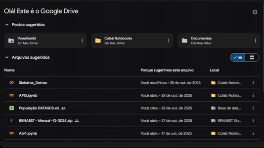
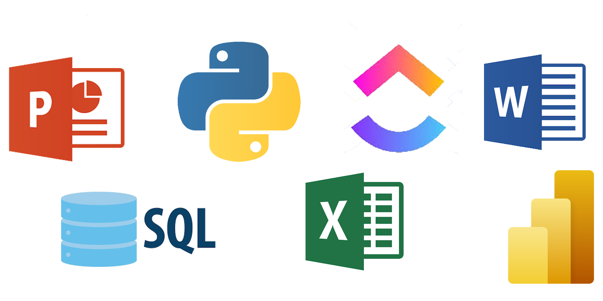

# API-3

 
 

 
## Índice
* [Proposta](#proposta)
* [Ferramentas Utilizadas](#ferramentas-utilizadas)
* 
# Proposta
Realizar a coleta de dados e análise aprofundada sobre os sinistros de trânsito, suas causas, resultados e detalhes para um levantamento dos principais indicadores e suas variações ao longo dos ultimos dez anos.

Será feita uma análise relacionando as variações na quantidade de sinístros com artigos informativos relacionados ao trânsito

Paralelamente, será conduzido um exame detalhado das principais causas de acicentes, os veículos e as regiões com maior registro

## Primeiro Sprint

Foram coletados dados de diferentes anos e agrupados em arquivos .CSV e feito o esboço do dashboard, mas não funcional. Apenas dos sinístros no estado de São Paulo. Para futuramente indicar as variações e as medidas tomadas ao longo dos anos para o controle de acidente.

## Segundo Sprint

 
 Será apresentado um dashboard com filtros de informações dos sinistro, além de mais detalhes com mapas.
 Além de feita a relação de artigos informativos com a quantidade de sinistros. Indicando as variações e as medidas tomadas ao longo dos anos para o controle de acidentes.

## Terceiro Sprint
 
 Realizaremos um dashboard assim como o do sprint anterior, porém englobando o país inteiro com informações obtidas nos ultimos dez anos

 
 

 # Ferramentas Utilizadas
 - ClickUp
 - Excel
 - Power Point
 - Microsoft Word
 - SQL Workbench
 - Python
 - Power BI
 - Drive

 # Aplicabilidade das Ferramentas
 ##  Para facilitar o tratamento dos dados, foi feito o agrupamento de cada tipo de dado em diferentes planílhas através de códigos nas linguagens Python e SQL, facilitando a interpretação e uso posterior.

 

 ### ClickUp
  Através dele foi desgnada a tarefa e o prazo das atividades de cada membro do projeto, indicando o nivel de prioridade de cada tarefa a ser realizada e em qual sprint devem ser entregues organiando em anexos os outros aplicativos utilizados

 ### Python
  Por haver uma quantidade massiva de plhanilhas com dados e de diferentes fontes, o que causava a divergencia da estrutura entre todas as planílhas, foi feita uma primeira filtragem por agrupamento de tipos de dados em outras tabelas geradas a partir do python
 ### SQL
  Após o agrupamento dos dados por tipo no Python, foram aplicados mais outros filtros e transformações para gerar tabelas segmentadas conforme os critérios analíticos definidos. Considerando a ausência de integração nativa entre o SQL Workbench e o Power BI, foi configurado o driver MySQL Connector/ODBC, permitindo a conexão via ODBC e a extração dos dados diretamente para o Power BI. Essa abordagem possibilitou a atualização dinâmica e o consumo eficiente das informações na camada de visualização.
 ### Excel
  Para viabilizar a filtragem da planilha principal por meio de consultas SQL, foram gerados diversos arquivos auxiliares contendo planilhas segmentadas de forma criteriosa, organizadas exclusivamente com os dados relevantes e estruturadas por ano. Essa abordagem permitiu otimizar o desempenho das consultas, reduzir a complexidade dos dados processados e facilitar a manipulação e análise das informações históricas de maneira eficiente e escalável.
 ### Drive
  Através do Google Drive criamos uma pasta de compatilhamento de arquivos entre os membros da equipe, com isso utilizamos o Google Colab para unificar diferentes arquivos em .csv
  
  
 # Backlog do Produto
|Rank|Prioridade|User Story|Estimativa|Sprint|
|----|----------|----------|----------|------|
|1|Alta|Como tomador de decisão de políticas públicas, quero que no dashboard contenha as principais métricas e escopos.|5|1°|
|2|Média|Como tomador de decisão de políticas públicas, quero um backlog detalhado e que contenha ordem de prioridade de entregas a serem apresentadas.|5|1º|
|3|Baixa|Como tomador de decisão de políticas públicas, quero o esqueleto inicial do dashboard, para entender os dados a serem mostrados. |5|1º|
|4|Alta|Como tomador de decisão de políticas públicas, quero uma base de dados inicial tratada e limpa, eliminando as informações inúteis, utilizando scripts básicos. |8|1º|
|5|Alta|Como tomador de decisão de políticas públicas, quero um fluxo de ETL em Python e MySQL. |8|2º|
|6|Média|Como tomador de decisão de políticas públicas, quero Graficos, com as informações de sinistros, mortes, frotas e população do estado de SP |6|2º|
|7|Média|Como tomador de decisão de políticas públicas, quero que sejam feitos testes para consolidar as consistências dos indicadores. |5|2º|
|8|Baixa|Como tomador de decisão de políticas públicas, quero a documentação do processo de integração e os primeiros resultados.|2|2º|
|9|Alta|Como tomador de decisão de políticas públicas, quero indicadores que mostrem mortalidade, sinistros por frota, motorização, comparativos. |7|2º|
|10|Média|Como tomador de decisão de políticas públicas, quero filtros interativos no dashboard.|4|2º|
|11|Alta|Como tomador de decisão de políticas públicas, quero que seja feito consolidação de análises por região e evolução dos indicadores (2015–2024). |8|3º|
|12|Baixa|Como tomador de decisão de políticas públicas, quero material de apoio (slides, resumo do projeto, guia de uso). |2|3º|
|13|Média|Como tomador de decisão de políticas públicas, quero visualizações refinadas (layout, navegação e comparativos regionais). |4|3º|
|14|Média|Como tomador de decisão de políticas públicas, quero um visual interativo no Power BI (mapas, séries históricas, comparativos). |4|3º|
|15|Alta|Como tomador de decisões de políticas públicas, quero um relatório técnico (metodologia, scripts comentados, insights por estado).|7|3º|

# Equipe

<table>
  <thead>
    <tr>
      <th>Cargo</th>
      <th>Nome</th>
      <th>Linkedin</th>
    </tr>
  </thead>
 <tbody>

 <tr>
  <td></td>
  <td>Leonardo Rocha</td>
  <td></td> 
</tr>
 <tr>
  <td></td>
  <td>Mateus Alexandre</td>
  <td></td> 
</tr>
 <tr>
  <td></td>
  <td>Pedro Hernandes</td>
  <td></td> 
</tr>
<tr>
 <td></td>
 <td>Kauê Venâncio</td>
 <td></td> 
</tr>
  </tbody>
</table>
